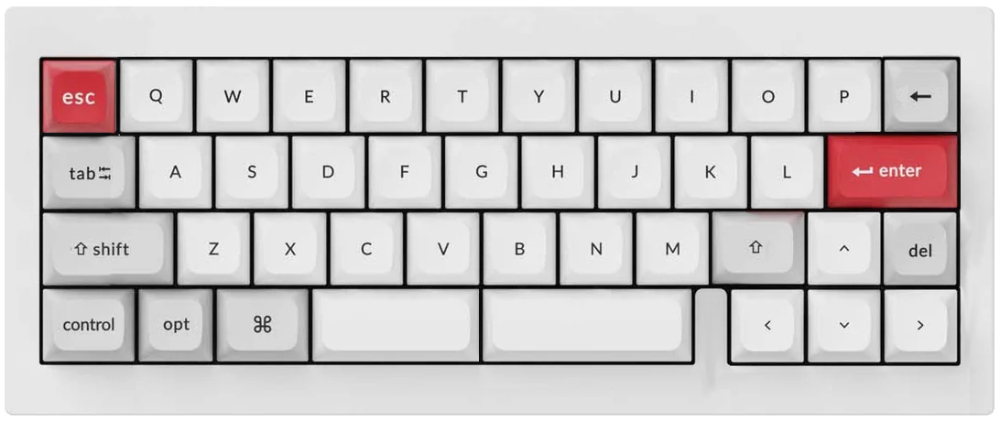
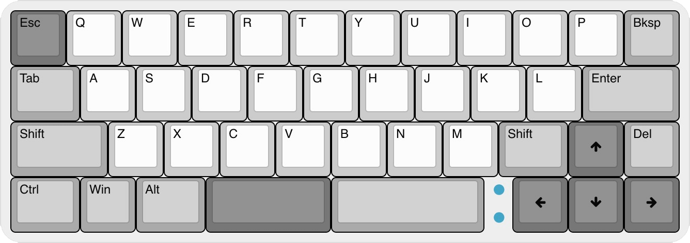
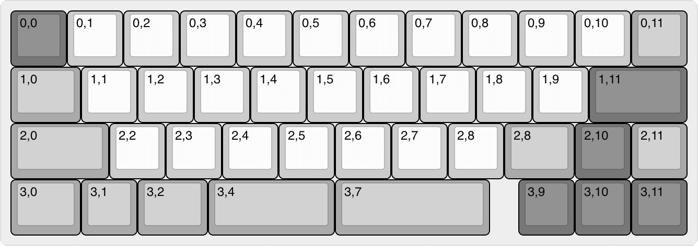

# VR42-Keyboard-PCB

> &#128679; `Product under development` &#128679;  
> &nbsp; &nbsp; &nbsp; &nbsp; &nbsp; &nbsp; &nbsp; &nbsp; &#9888;&#9888;&#9888;&#9888;&#9888;&#9888;&#9888;&#9888;&#9888;&#9888;  
> &nbsp; &nbsp; &nbsp; &nbsp; &nbsp; &nbsp; &nbsp; &nbsp; &#9888; ***DO NOT BUILD*** &#9888;  
> &nbsp; &nbsp; &nbsp; &nbsp; &nbsp; &nbsp; &nbsp; &nbsp; &#9888;&#9888;&#9888;&#9888;&#9888;&#9888;&#9888;&#9888;&#9888;&#9888;  
> &#128679; `_________________________` &#128679;

## Intent

A 42-key micro keyboard designed for QMK with specific focus on ultra fast key scan rates / poll rates to make for an ideal gaming keyboard.

### Layout ideation renders

#### Render

#### Layout

#### Matrix coordinates *(QMK & VIA)*

## Planned Features

- [ ] QMK / Vial build
- [ ] 1x `STM32F405` STM32 CPU *(ft. dual USB, one is FS, the other HS)*
- [ ] 1x `TS3USB221` USB 2.0 Multiplexer for USB port selection *(based on [akeypad](https://github.com/luantty2/akeypad) )*
- [ ] 1x `USB3300-EZK` Hi-Speed USB Host for OTG PHY pin interface
- [ ] ~~1x `W25Q64JW` 8K SPI Flash Module~~
- [ ] 1x `M95640-DRE` 8K SPI EEPROM Module
- [ ] 6x `MC74HC589A` SPI Input Shift Registers
    - No QMK key matrix, using all direct pins for faster scan rates
    - Scan via individually grounded keys on shift registers
- [ ] 2x `IS31FL3746B` SPI LED Matrix Drivers
    - 43x RGB LED's
    - With power on/off `TPS22995H-Q1` load switch
- [ ] C4 *(or S1)* UDB Usb-C - see: https://github.com/ai03-2725/Unified-Daughterboard

## Possible BIG issues

- With very limited PCB space, 13x IC's may not fit :(
- Not sure QMK can handle High Speed USB
- Not sure dual USB is switchable with the USB multiplexer
    - FS USB required for Bootloader
    - HS USB required for >1KHz polling rates

---
Made with &#9829; by Vino Rodrigues