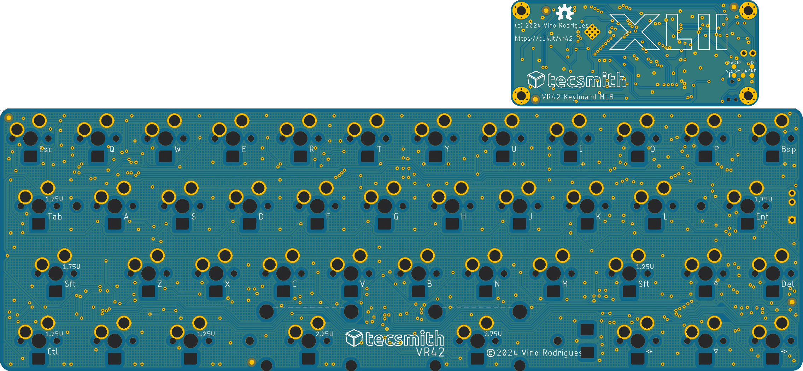
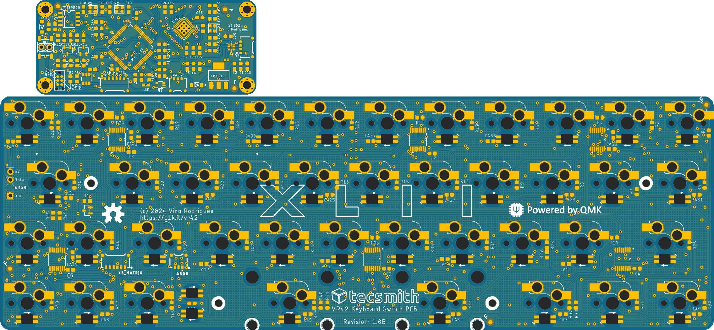
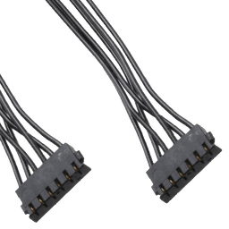
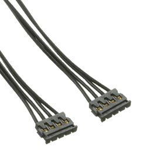
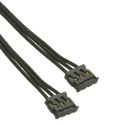

# VR42-Keyboard-PCB

## Intent

A 42-key micro keyboard designed for QMK with specific focus on ultra fast key scan rates / poll rates to make for an ideal gaming keyboard.

## Progression

- **22 Sep 2024**: Beta 1 done
  - WARNING: Not manufactured *(yet)*
  - WARNING: Not tested *(yet)*
- See [CHANGELOG.md](CHANGELOG.md)

## Resources

### Schematic
 - PDF [here](docs/vr42-revB.pdf)

### MCU PCB
 - EAGLE BRD *(PCB)* [here](EAGLE/vr42/vr42-revB-kbd.brd)
 - EAGLE SCH *(Schematic)* [here](EAGLE/vr42/vr42-revB-kbd.sch)

### Key Switch PCB
 - EAGLE BRD *(PCB)* [here](EAGLE/vr42/vr42-revB-kbd.brd)
 - EAGLE SCH *(Schematic)* [here](EAGLE/vr42/vr42-revB-kbd.sch)

### Beta PCB renders

#### Top

#### Bottom *(Component side)*

#### Intra-Board Connectors

You will need 3x Molex Pico-EZMate cables

|                                                                 | Cable | Usage                                |
|:---------------------------------------------------------------:|:-----:|:-------------------------------------|
| </img> | 6 way | Keyboard Matrix SPI interface        |
| </img> | 4 way | USB connection to UBD                |
| </img> | 3 way | ARGB to drive status & per-key LED's |

### Layout ideation renders

#### Render

#### Layout

#### Matrix coordinates *(QMK & VIA)*

## Planned Features

- [ ] QMK / VIA build
- [ ] 1x `STM32F405` STM32 CPU *(ft. dual USB, one is FS, the other HS)*
- [ ] 1x `TS3USB221` USB 2.0 Multiplexer for USB port selection *(based on [akeypad](https://github.com/luantty2/akeypad) )*
- [ ] 1x `USB3300-EZK` Hi-Speed USB Host for OTG PHY pin interface
- [ ] ~~1x `W25Q64JW` 8K SPI Flash Module~~ *[Not needed, the MCU has 512K Flash]*
- [ ] 1x `M95640-DRE` 8K SPI EEPROM Module
- [ ] 6x `MC74HC589A` SPI Input Shift Registers
    - No QMK key matrix, using all direct pins for faster scan rates
    - Scan via individually grounded keys on shift registers
- [ ] 2x `IS31FL3746B` SPI LED Matrix Drivers
    - 43x RGB LED's
    - With power on/off `TPS22995H-Q1` load switchs, 1 per
- [ ] C4 *(or S1)* UDB USB-C by @ai03 - see [here](https://github.com/ai03-2725/Unified-Daughterboard)

## Possible BIG issues

- [x] ~~With very limited PCB space, 13x IC's may not fit :(~~ *[Resolved with separate key and MCU PCB's]*
- [ ] ~~Not sure QMK can handle High Speed USB~~ *[It can, just now need to do it :( )]*
- [ ] Not sure dual USB is switchable with the USB multiplexer *[Needs to be coded for and tested]*
    - FS USB required for Bootloader
    - HS USB required for >1KHz polling rates

&nbsp; &nbsp;
---
Made with &#9829; by **Vino Rodrigues**