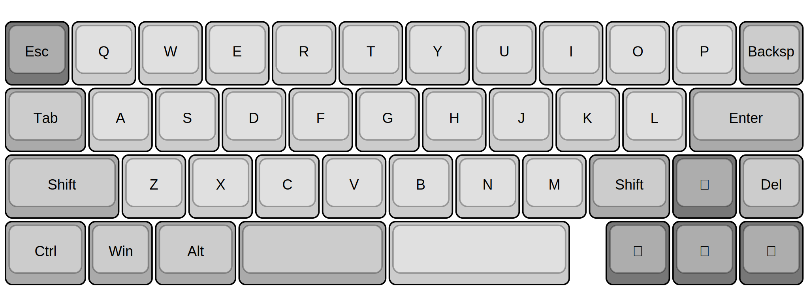

# VR42-Keyboard-PCB

> &#128679; Placeholder for future project &#128679;

## Intent

A 42-key micro keyboard designed for QMK with specific focus on ultra fast key scan rates / poll rates to make for an ideal gaming keyboard.

## Planned Features

- [ ] QMK / Vial build
- [ ] 1x `STM32F411` STM32 CPU *(based on Black Pill design)*
    - `STM32F411CE`
    - 100Mhz Freq.
    - 128KB RAM
    - 512KB ROM
- [ ] 1x `W25Q64JW` 8K SPI Flash Module
- [ ] 1x `M95640-DRE` 8K SPI EEPROM Module
- [ ] 6x `MC74HC589A` SPI Input Shift Registers
    - No QMK key matrix ... scan via individually grounded keys on shift registers
- [ ] 2x `IS31FL3746A` I2C LED Matrix Drivers
    - 43x RGB LED's
    - with power on/off MOSFET
- [ ] C3 UDB Usb-C 

## Possible BIG issues

- With very limited PCB space, 13x IC's may not fit :(